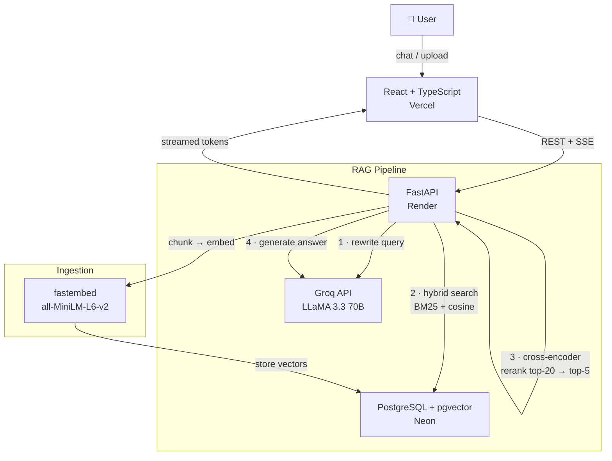

# MedRAG Assistant


[](https://python.org)
[](https://fastapi.tiangolo.com)
[](https://github.com/pgvector/pgvector)
[](https://react.dev)
[](https://api-linga.onrender.com)
[](https://medrag-frontend-lilac.vercel.app)

**[Live Demo](https://medrag-frontend-lilac.vercel.app)** · **[API Docs](https://api-linga.onrender.com/docs)**

---

## What It Does

MedRAG Assistant lets clinicians and researchers upload medical PDFs (guidelines, clinical studies, drug references) and ask natural language questions against them. It uses **hybrid retrieval** (BM25 + semantic search) with **cross-encoder re-ranking** to surface the most relevant context, **query rewriting** to handle follow-up questions in multi-turn conversations, and **Groq's LLaMA 3.3 70B** to generate grounded answers with source citations — all deployed on a free-tier stack with no cold-start model downloads.

---

## Architecture



---

## Tech Stack

| Layer | Technology | Why |
|---|---|---|
| **API** | FastAPI + Uvicorn | Async-native, auto OpenAPI docs |
| **Database** | PostgreSQL + pgvector (Neon) | Single store for documents, vectors, and chat history |
| **Embeddings** | fastembed (ONNX) | No PyTorch — fits in 512 MB Render free tier |
| **LLM** | Groq LLaMA 3.3 70B | Free tier, OpenAI-compatible, fast inference |
| **Retrieval** | Hybrid BM25 + cosine + RRF | Handles exact medical terms and semantic queries |
| **Reranker** | Cross-encoder (ms-marco-MiniLM) | Re-scores top-20 candidates before generation |
| **Frontend** | React + TypeScript + Tailwind + shadcn/ui | Vercel |
| **Evaluation** | RAGAS + OpenAI gpt-4o-mini | Industry-standard RAG metrics |

---

## Key Engineering Decisions

### Hybrid search (BM25 + semantic) for medical terminology
Pure semantic search fails on medical abbreviations and drug names — "eGFR", "SGLT2", "A1C" have no common synonyms in the embedding space. BM25 handles exact-match recall; semantic search handles paraphrasing. Reciprocal Rank Fusion (RRF) merges both ranked lists without requiring score normalization.

### Cross-encoder re-ranking
Bi-encoder retrieval (cosine similarity) is fast but approximate — it compares query and chunk embeddings independently. A cross-encoder sees both together and re-scores token-level interactions. We retrieve 20 candidates and rerank to the top 5 sent to the LLM, improving precision without increasing retrieval latency significantly.

### Query rewriting for multi-turn conversations
A follow-up like *"what about the dosage?"* has no meaning without conversation history. Before retrieval, the system rewrites the query to a standalone question using prior turns, so retrieval always works on a self-contained query.

### pgvector over Pinecone / Weaviate
pgvector keeps vectors in the same Postgres instance as documents and chat history — one connection, one transaction boundary, one backup. For a project at this scale, a dedicated vector database adds operational complexity with no measurable benefit.

### OpenAI for evaluation (after testing alternatives)
Evaluated three judge configurations before settling on OpenAI:
- **FastEmbed (local)** — embedding similarity only, blind to negation and hallucinations
- **Ollama llama3.2** — free but too slow for CI use (5+ min/sample), JSON parsing errors
- **Groq** — fast but daily token limits exhausted during iterative eval runs
- **OpenAI gpt-4o-mini** — reliable JSON output, <$0.005 per full eval run, no rate issues

---

## Evaluation Results

Evaluated on 15 hand-written Q&A pairs across three medical topics: diabetes guidelines, heart failure, and NNDS survey data. Judge: OpenAI `gpt-4o-mini` via RAGAS.

| Metric | Score | What It Measures |
|---|---|---|
| **Context Recall** | **0.933** | Retrieved chunks cover the reference answer |
| **Context Precision** | **0.882** | Retrieved chunks are relevant (low noise) |
| **Faithfulness** | **0.862** | Answer claims are grounded in retrieved context |
| **Answer Relevancy** | **0.811** | Answer addresses the question asked |
| **Answer Correctness** | **0.493** | Semantic + factual match to reference answer |

**On answer correctness:** The 0.49 reflects a known limitation of the metric — it penalizes paraphrasing even when the answer is factually correct. The LLM generates complete sentences while reference answers are short fragments. The high faithfulness (0.86) and context recall (0.93) are stronger indicators of actual system quality.

---

## Local Development

```bash
git clone https://github.com/mahalingam-dev-8/medrag-backend.git
cd medrag-backend
python -m venv venv && source venv/bin/activate
pip install -e .
uvicorn app.main:app --reload
```

**Run evaluation** (requires `OPENAI_API_KEY` in `.env`):
```bash
pip install ".[eval]"
python evaluation/run_eval.py --api-url http://localhost:8000
```

---

## Future Work

- **Background task queue** — replace FastAPI `BackgroundTasks` with Celery + Redis for reliable async ingestion with retries and progress tracking
- **Retrieval A/B benchmarking** — automated comparison of chunk sizes, top-k values, and hybrid search weights against the RAGAS eval set
- **Redis caching** — cache embeddings and frequent query results to reduce Groq API calls
- **Local LLM via Ollama** — swap Groq for a self-hosted model for air-gapped / HIPAA-sensitive deployments
- **Multi-modal support** — extract and index tables and figures from medical PDFs using a vision model

---

## Related

- [Frontend Repository](https://github.com/mahalingam-dev-8/medrag-frontend) — React + TypeScript + shadcn/ui
